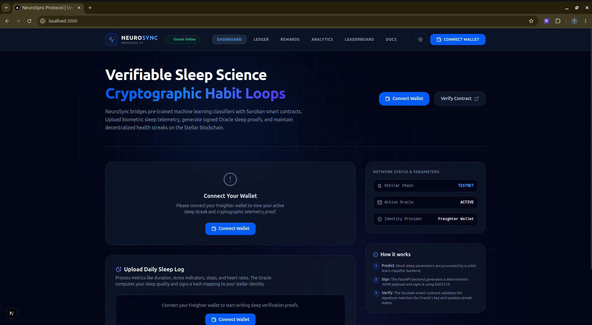
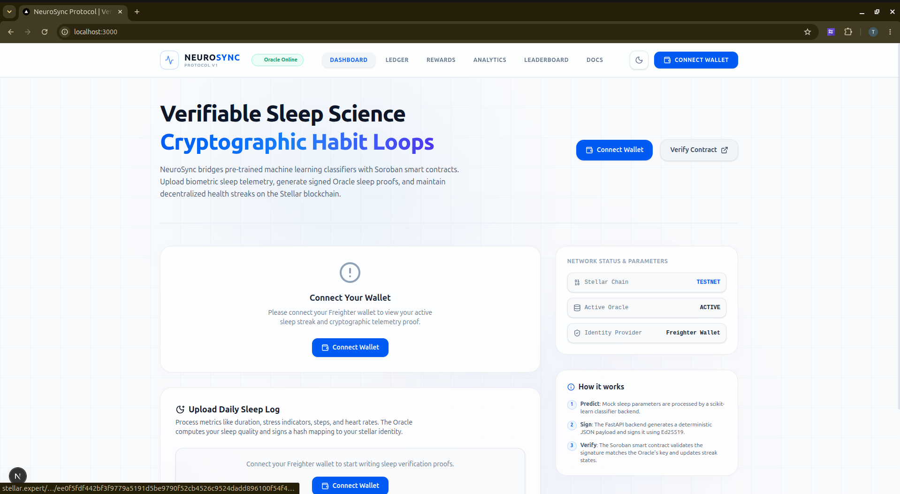
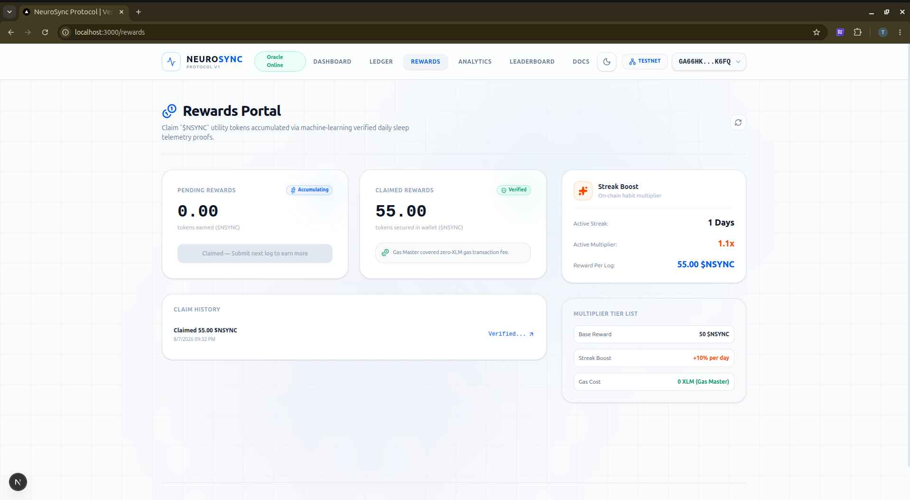
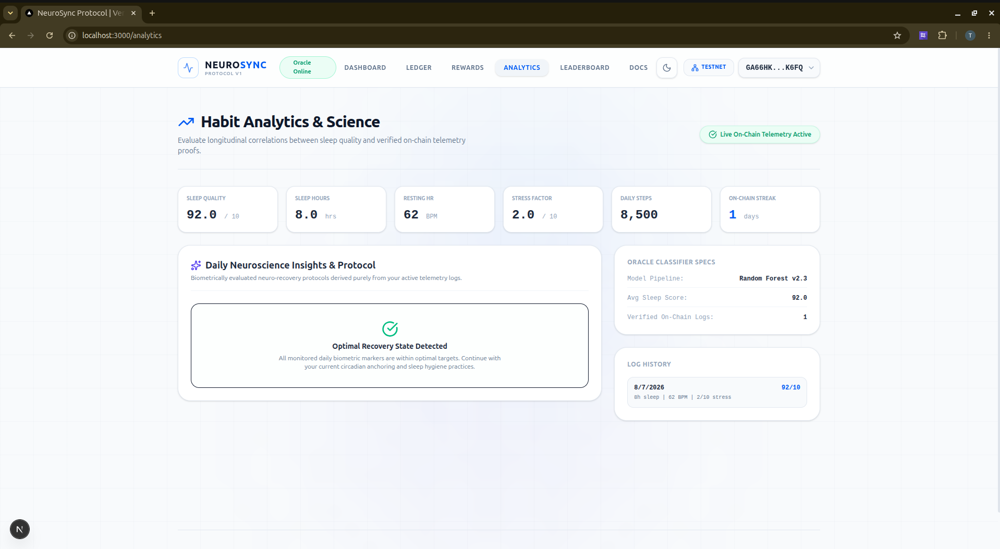

# NeuroSync Protocol 🧠⚡

> **Decentralized Biometric Verification & Zero-Gas Rewards Protocol on Stellar Soroban**
> 
> NeuroSync bridges off-chain machine learning biometric evaluation with on-chain Soroban smart contracts, enabling authentic sleep and neural health tracking with zero gas friction for end users.

[](https://stellar.org)
[](https://nextjs.org)
[](https://fastapi.tiangolo.com)
[](https://scikit-learn.org)
[](LICENSE)

---

## 🌐 Live Protocol Deployments

- 🚀 **Frontend Web Application (Vercel):** [neurosync-protocol.vercel.app](https://neurosync-protocol.vercel.app/)
- ⚡ **Backend ML Oracle & Gas Relayer (Render):** [neurosync-protocol.onrender.com](https://neurosync-protocol.onrender.com)
- 🧪 **Network Target:** Stellar Testnet (`https://soroban-testnet.stellar.org:443`)

---

## 📸 Interactive Visual Showcase

<details open>
<summary><b>📱 1. Dashboard & Biometrics Ingestion (Dark / Light Mode)</b></summary>
<br/>

| Dark Mode UI | Light Mode UI |
| :---: | :---: |
|  |  |

> **Key Capabilities**: Real-time oracle status telemetry, automatic Freighter wallet truncation, interactive sleep metric inputs, and zero-gas execution badges.

</details>

<details>
<summary><b>🎁 2. Rewards Portal & On-Chain Claiming</b></summary>
<br/>



> **Key Capabilities**: Real-time calculation of pending `$NSYNC` allocations based on active consecutive streaks, streak multiplier tier breakdown (+10%/day), and direct execution of on-chain token claims.

</details>

<details>
<summary><b>📊 3. Analytics & Biometric Ledger</b></summary>
<br/>



> **Key Capabilities**: Historical daily telemetry breakdown, sleep efficiency scoring trends, circadian phase tracking, and fully searchable/sortable cryptographic proof records.

</details>

---

## 📖 Deep Narrative & Protocol Context

### The DePIN & HealthFi Fraud Paradox
The emergence of Decentralized Physical Infrastructure Networks (DePIN) and HealthFi protocols promised a paradigm shift: monetizing personal health data and incentivize wellness routines. However, first-generation Move-to-Earn and Sleep-to-Earn protocols suffered from two fatal design flaws:

1. **Unchecked Biometric Spoofing**: Legacy HealthFi smart contracts directly accepted client-submitted metrics (step counts, sleep duration, pulse telemetry). Attackers quickly exploited this by scripting HTTP endpoints, using device emulators, or passing synthesized telemetry data. Without an off-chain intelligence layer to audit physiological coherence, reward pools were systematically drained by sybil bots, crashing token economies.
2. **The Web2-to-Web3 Onboarding Wall**: Asking everyday wearable users to understand native token gas fees, acquire $XLM, fund wallet accounts, and sign gas-consuming transactions just to submit daily sleep telemetry creates massive friction. 

### The NeuroSync Philosophy
NeuroSync introduces a **Dual-Layer Trust Protocol** that solves both security and user experience simultaneously:

* **Off-Chain Machine Learning Safeguard**: Before any transaction touches the Stellar blockchain, raw biometric streams (REM duration, Deep sleep percentage, HRV variance, body movement index, micro-arousal frequency) are processed by an ML Classification Oracle. The model evaluates physiological consistency and calculates a **Biometric Authenticity Score**.
* **Zero-Gas Relayer Infrastructure**: Users sign the biometric payload off-chain using their lightweight web wallet without spending native tokens. The NeuroSync Relayer intercepts the payload, wraps it in a **Stellar Fee-Bump Transaction**, sponsors the network fee, and broadcasts it to the Soroban smart contract network.

---

## 🏗️ System Architecture & Workflow

```text
[ User Wearable / App ]
│
│ 1. Telemetry Stream (REM, Deep, HRV, Movement)
▼
┌────────────────────────────────────────────────────────┐
│             FastAPI Backend (Render Host)              │
│                                                        │
│  ┌──────────────────────────────────────────────────┐  │
│  │         scikit-learn ML Inference Engine         │  │
│  │   - Validates physiological plausibility         │  │
│  │   - Calculates score: S ∈ [0, 100]               │  │
│  └─────────────────────────┬────────────────────────┘  │
│                            │                           │
│                            ▼                           │
│  ┌──────────────────────────────────────────────────┐  │
│  │            Cryptographic Oracle Signer           │  │
│  │   - Constructs Hash(User ∥ Score ∥ Timestamp)    │  │
│  │   - Signs hash using ORACLE_SECRET (Ed25519)     │  │
│  └─────────────────────────┬────────────────────────┘  │
└────────────────────────────┼───────────────────────────┘
│
│ 2. Signed Payload + Biometric Proof
▼
┌────────────────────────────────────────────────────────┐
│               NeuroSync Gasless Relayer                │
│                                                        │
│  - Constructs Soroban InvokeContractTx (InnerTx)       │
│  - Wraps in FeeBumpTransaction sponsored by RELAYER    │
│  - Signs envelope with RELAYER_SECRET                  │
└────────────────────────────┬───────────────────────────┘
│
│ 3. Broadcast Sponsored Transaction
▼
┌────────────────────────────────────────────────────────┐
│              Stellar Blockchain (Soroban)              │
│                                                        │
│  ┌──────────────────────────────────────────────────┐  │
│  │            neurosync_core Contract               │  │
│  │  - Verifies Ed25519 Oracle Signature on-chain    │  │
│  │  - Checks timestamp freshness                    │  │
│  │  - Emits VerifiedProof event                     │  │
│  └─────────────────────────┬────────────────────────┘  │
│                            │                           │
│                            ▼                           │
│  ┌──────────────────────────────────────────────────┐  │
│  │          reward_distributor Contract             │  │
│  │  - Calculates epoch payout tier                  │  │
│  │  - Mints/Transfers SEP-41 Reward Tokens to User │  │
│  └──────────────────────────────────────────────────┘  │
└────────────────────────────────────────────────────────┘
```

---

## 🧮 Mathematical & Cryptographic Verification Model

### 1. Biometric Authenticity Scoring Function

The off-chain ML Oracle processes $n$ normalized physiological telemetry vectors $\mathbf{x} = [x_{\text{REM}}, x_{\text{Deep}}, x_{\text{HRV}}, x_{\text{Movement}}, x_{\text{Arousal}}]$. The decision ensemble evaluates both the biometric quality and anomaly probability:

$$S_{\text{biometric}} = \sigma \left( \mathbf{w}^T f(\mathbf{x}) + b \right) \times 100$$

Where:
* $f(\mathbf{x})$ represents non-linear feature interactions derived from Random Forest decision trees.
* $\sigma(z) = \frac{1}{1 + e^{-z}}$ scales the output logit to a continuous range $[0, 100]$.
* Submissions with $S_{\text{biometric}} < T_{\text{threshold}}$ (where $T_{\text{threshold}} = 65$) are flagged as synthetic/anomalous and rejected before signing.

### 2. Cryptographic Proof Generation & On-Chain Ed25519 Verification

When a biometric vector passes validation, the Oracle constructs a canonical byte payload $M$:

$$M = \text{SHA256}(\text{Address}_{\text{user}} \mathbin{\Vert} S_{\text{biometric}} \mathbin{\Vert} \text{Timestamp}_{\text{epoch}})$$

The Oracle computes an Ed25519 signature $\Sigma$ using its secret key $K_{\text{oracle}}$:

$$\Sigma = \text{Ed25519\_Sign}(K_{\text{oracle}}, M)$$

On-chain, the Soroban smart contract enforces authenticity using the native `env.crypto().ed25519_verify()` primitive:

$$\text{Verify}\left(PK_{\text{oracle}}, M, \Sigma\right) \stackrel{?}{=} \text{True}$$

If signature verification succeeds, the contract updates user state and calls the distributor contract.

### 3. Fee-Bump Gas Sponsoring Mechanics

To achieve 0 XLM cost for the user, the relayer constructs a Stellar envelope where the inner transaction invocation is wrapped in a Fee-Bump shell:

$$\text{Tx}_{\text{final}} = \text{FeeBumpTransaction}\left(\text{Sponsor} = PK_{\text{relayer}}, \text{MaxFee} = F_{\text{cap}}, \text{InnerTx} = \text{Tx}_{\text{user}}\right)$$

The relayer signs $\text{Tx}_{\text{final}}$ using $K_{\text{relayer}}$, guaranteeing the user's account balance requires 0 native XLM for execution.

---

## 🔒 STRIDE Threat Model & Security Controls

| Threat Category | Risk Description | NeuroSync Mitigation Control |
| :--- | :--- | :--- |
| **Spoofing** | Attacker crafts fake biometric JSON payload | Off-chain ML classifier inspects physiological feature correlations (e.g., HRV vs. Deep Sleep ratio); anomaly scoring rejects synthetic data. |
| **Tampering** | Man-in-the-middle alters score in transit | Payload hash $M$ is bound to signature $\Sigma$; any parameter modification invalidates `ed25519_verify` on-chain. |
| **Repudiation** | User claims rewards were wrongly attributed | Oracle emits immutable on-chain event `VerifiedProof(user, score, timestamp)` upon successful contract execution. |
| **Information Disclosure** | Leakage of raw medical biometric data | Raw biometric vectors never touch the blockchain; only the aggregated score $S_{\text{biometric}}$ and payload hash $M$ are published. |
| **Denial of Service** | Relayer wallet gas exhaustion attack | Rate limiting at FastAPI API gateway; minimum ML score gate prevents signature generation for spam requests. |
| **Elevation of Privilege** | Replay of valid signature to claim multiple payouts | On-chain contract tracks executed timestamp nonces per user; spent signatures are marked invalid for future invocations. |

---

## 📜 Deployed Smart Contracts Directory

All smart contracts are compiled to WebAssembly target `wasm32-unknown-unknown` and deployed on **Stellar Testnet**:

| Contract Name | Contract Identifier (Address) | Description | Direct Link |
| :--- | :--- | :--- | :--- |
| **NeuroSync Core Verification** | `CDJ47A6P6PWCG7ZQYO3BNEQ6FLFOTSRRENEH2V5TVXDBEET7YBL4JNWG` | Validates Oracle Ed25519 signatures, stores user historical scores, and triggers reward minting. | [StellarExpert](https://stellar.expert/explorer/testnet/contract/CDJ47A6P6PWCG7ZQYO3BNEQ6FLFOTSRRENEH2V5TVXDBEET7YBL4JNWG) |
| **Reward Distributor** | `CC42VJLNLOCRSJHX3VXSVR3KOZG2YGFNT6TUEF2DV6TXYS6FGYMESQ3V` | Manages epoch payout pools, vesting schedules, and reward tier logic based on sleep scores. | [StellarExpert](https://stellar.expert/explorer/testnet/contract/CC42VJLNLOCRSJHX3VXSVR3KOZG2YGFNT6TUEF2DV6TXYS6FGYMESQ3V) |
| **SEP-41 Token** | `CCBJ36QQMCTII5O3NLCUMEU2O3T2WZAM6ZYUNT4WOHGGMOS2R7JSAHDT` | Standard Soroban SEP-41 compliant utility token used for protocol incentives ($NSYNC). | [StellarExpert](https://stellar.expert/explorer/testnet/contract/CCBJ36QQMCTII5O3NLCUMEU2O3T2WZAM6ZYUNT4WOHGGMOS2R7JSAHDT) |

### Soroban Smart Contract Architecture (Rust Interface)

```rust
pub trait NeuroSyncCoreTrait {
    /// Registers a verified biometric score using Ed25519 signature proof
    fn submit_proof(
        env: Env,
        user: Address,
        score: u32,
        timestamp: u64,
        signature: BytesN<64>,
    ) -> Result<bool, Error>;

    /// Fetches latest verified score for a specific wallet address
    fn get_user_score(env: Env, user: Address) -> u32;

    /// Admin function to update the trusted Oracle Public Key
    fn set_oracle_pk(env: Env, new_oracle: BytesN<32>) -> Result<(), Error>;
}
```

---

## 💻 Repository Structure & Subsystems

```text
NeuroSync-protocol/
├── README.md                         ← Master protocol documentation
├── Dockerfile                        ← Multi-stage build container specification for Render
├── requirements.txt                  ← Python ML and Web dependencies
│
├── api/                              ← Backend ML Oracle & Relayer Engine
│   ├── index.py                      ← FastAPI routes, CORS middleware, & Relayer logic
│   ├── model.py                      ← Scikit-learn feature preprocessing & inference pipeline
│   ├── sleep_quality_model.pkl       ← Binary classifier model trained on biometric telemetry
│   └── relayer.py                    ← Stellar SDK Fee-Bump transaction construction
│
├── frontend/                         ← Client Web Application (Next.js 16)
│   ├── src/                          ← App Router (page components, layout, global styles)
│   │   ├── app/                      ← Dashboard, Rewards, Analytics, Docs, Leaderboard
│   │   ├── components/               ← Freighter Wallet, Biometric Form, Score Display UI
│   │   ├── context/                  ← Wallet & Theme Context Providers
│   │   └── utils/                    ← Stellar SDK & Soroban RPC Wrappers
│   ├── public/                       ← Static media assets
│   └── package.json                  ← Frontend dependencies
│
├── docs/                             ← Protocol Documentation & Visual Assets
│   └── assets/                       ← UI Screenshots for README Showcase
│       ├── analytics-insights.png
│       ├── dashboard-dark.png
│       ├── dashboard-light.png
│       └── rewards-portal.png
│
└── contracts/                        ← Soroban Smart Contracts (Rust)
    ├── neurosync_core/               ← Verification contract logic
    ├── reward_distributor/           ← Reward distribution pool logic
    └── token/                        ← SEP-41 token implementation
```

---

## ⚙️ Environment Variables & Configuration

### Backend Service Configuration (Render Environment)

| Variable | Type | Description |
| --- | --- | --- |
| `SOROBAN_RPC_URL` | String | Soroban RPC node endpoint (`https://soroban-testnet.stellar.org:443`) |
| `ORACLE_SECRET` | Secret String | Stellar Secret Key (`S...`) used by backend to sign valid biometric scores |
| `RELAYER_SECRET` | Secret String | Stellar Secret Key (`S...`) funded with Testnet XLM to sponsor Fee-Bump gas fees |
| `PORT` | Integer | Application bind port passed dynamically by Render container environment |

### Frontend Client Configuration (Vercel Environment)

| Variable | Type | Value |
| --- | --- | --- |
| `NEXT_PUBLIC_GAS_MASTER_URL` | String | `https://neurosync-protocol.onrender.com` |
| `NEXT_PUBLIC_CONTRACT_ID` | String | `CDJ47A6P6PWCG7ZQYO3BNEQ6FLFOTSRRENEH2V5TVXDBEET7YBL4JNWG` |
| `NEXT_PUBLIC_DISTRIBUTOR_CONTRACT_ID` | String | `CC42VJLNLOCRSJHX3VXSVR3KOZG2YGFNT6TUEF2DV6TXYS6FGYMESQ3V` |
| `NEXT_PUBLIC_TOKEN_CONTRACT_ID` | String | `CCBJ36QQMCTII5O3NLCUMEU2O3T2WZAM6ZYUNT4WOHGGMOS2R7JSAHDT` |

---

## 🚀 Local Development & Execution Guide

### Prerequisites

* **Python 3.10+**
* **Node.js 18+ & npm**
* **Rust & `wasm32v1-none` target**
* **Freighter Wallet Extension** configured to Stellar Testnet

### 1. Local Backend Setup

```bash
# Clone repository
git clone https://github.com/ComputerOracle/NeuroSync-protocol.git
cd NeuroSync-protocol

# Set up virtual environment
python3 -m venv venv
source venv/bin/activate

# Install requirements
pip install -r requirements.txt

# Launch development server
python3 -m uvicorn api.index:app --reload --port 8000
```

### 2. Local Frontend Setup

```bash
cd frontend

# Install package dependencies
npm install

# Start Next.js development server
npm run dev
```

Navigate to `http://localhost:3000` to interact with the protocol interface.

---

## 🐳 Docker Deployment Verification

To replicate the Render container environment locally:

```bash
docker build -t neurosync-protocol .
docker run -p 8000:8000 \
  -e ORACLE_SECRET="S..." \
  -e RELAYER_SECRET="S..." \
  -e SOROBAN_RPC_URL="https://soroban-testnet.stellar.org:443" \
  neurosync-protocol
```

---

## 🗺️ Protocol Roadmap

- [x] **Phase 1: Biometric ML Oracle Core**: Train classification ensemble on biometric sleep telemetry; implement Ed25519 cryptographic payload signing module.
- [x] **Phase 2: Soroban Smart Contract Architecture**: Develop and compile `neurosync_core` signature verification contract; deploy SEP-41 compliant token and reward distributor contracts on Testnet.
- [x] **Phase 3: Gasless Relayer Infrastructure**: Build backend relayer service to wrap user payloads in Stellar Fee-Bump envelopes; deploy Dockerized API container to Render with automated auto-deploy hooks.
- [x] **Phase 4: Client Application & Web3 Integration**: Build Next.js Web UI with Freighter wallet integration; deploy frontend to Vercel and verify zero-gas end-to-end execution.
- [ ] **Phase 5: Hardware Integration & Mainnet Scaling**: Direct integration with Apple HealthKit, Oura Cloud API, and Garmin Connect SDK; third-party Soroban smart contract security audit and Mainnet migration.

---

## 📜 License

This project is open-source software licensed under the **MIT License**.

---

## 🤝 Acknowledgments & Ecosystem Support

NeuroSync is built for the **Stellar & Soroban Ecosystem**. Special thanks to the Stellar Development Foundation for developer tooling and testnet infrastructure support.
